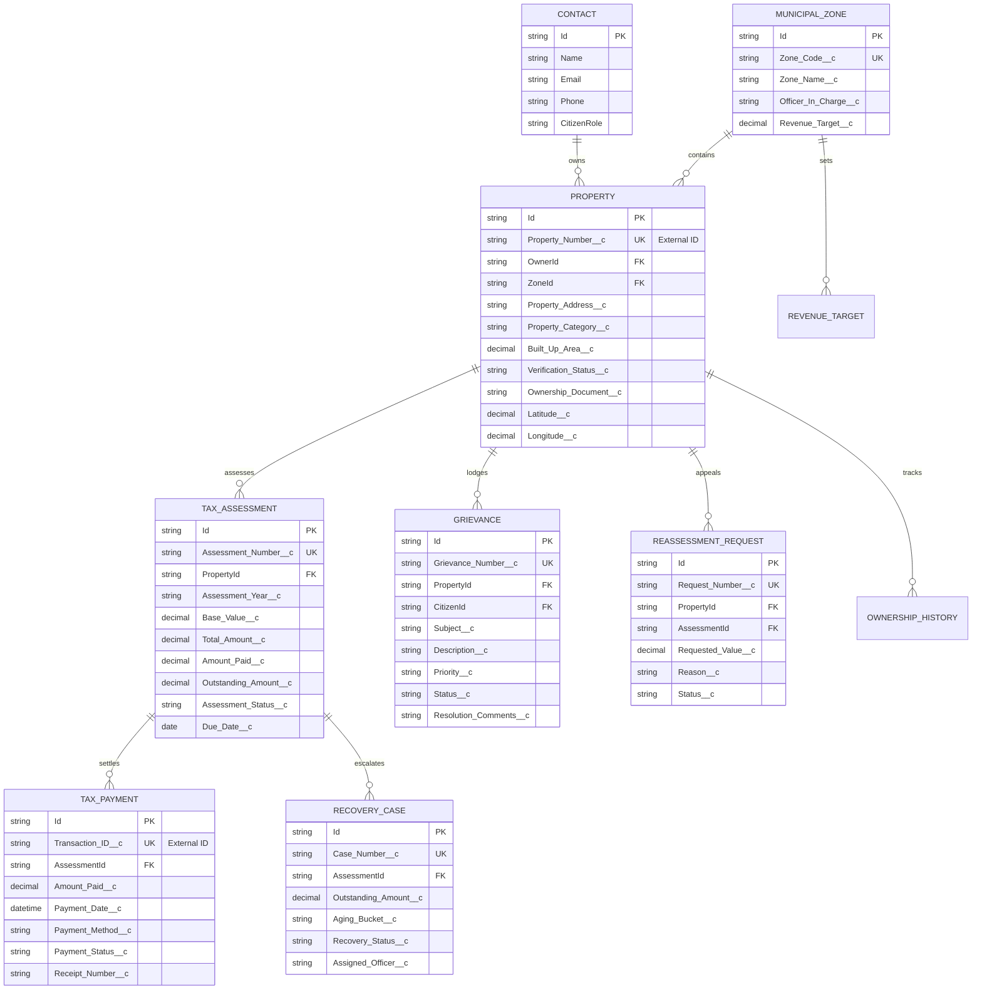

# CIVICTAX Entity-Relationship (ER) Diagram

```mermaid
erDiagram
    CONTACT ||--o{ PROPERTY : "owns"
    MUNICIPAL_ZONE ||--o{ PROPERTY : "contains"
    PROPERTY ||--o{ TAX_ASSESSMENT : "assesses"
    PROPERTY ||--o{ GRIEVANCE : "lodges"
    PROPERTY ||--o{ REASSESSMENT_REQUEST : "appeals"
    PROPERTY ||--o{ OWNERSHIP_HISTORY : "tracks"
    TAX_ASSESSMENT ||--o{ TAX_PAYMENT : "settles"
    TAX_ASSESSMENT ||--o{ RECOVERY_CASE : "escalates"
    MUNICIPAL_ZONE ||--o{ REVENUE_TARGET : "sets"

    CONTACT {
        string Id PK
        string Name
        string Email
        string Phone
        string CitizenRole
    }

    MUNICIPAL_ZONE {
        string Id PK
        string Zone_Code__c UK
        string Zone_Name__c
        string Officer_In_Charge__c
        decimal Revenue_Target__c
    }

    PROPERTY {
        string Id PK
        string Property_Number__c UK "External ID"
        string OwnerId FK
        string ZoneId FK
        string Property_Address__c
        string Property_Category__c
        decimal Built_Up_Area__c
        string Verification_Status__c
        string Ownership_Document__c
        decimal Latitude__c
        decimal Longitude__c
    }

    TAX_ASSESSMENT {
        string Id PK
        string Assessment_Number__c UK
        string PropertyId FK
        string Assessment_Year__c
        decimal Base_Value__c
        decimal Total_Amount__c
        decimal Amount_Paid__c
        decimal Outstanding_Amount__c
        string Assessment_Status__c
        date Due_Date__c
    }

    TAX_PAYMENT {
        string Id PK
        string Transaction_ID__c UK "External ID"
        string AssessmentId FK
        decimal Amount_Paid__c
        datetime Payment_Date__c
        string Payment_Method__c
        string Payment_Status__c
        string Receipt_Number__c
    }

    GRIEVANCE {
        string Id PK
        string Grievance_Number__c UK
        string PropertyId FK
        string CitizenId FK
        string Subject__c
        string Description__c
        string Priority__c
        string Status__c
        string Resolution_Comments__c
    }

    REASSESSMENT_REQUEST {
        string Id PK
        string Request_Number__c UK
        string PropertyId FK
        string AssessmentId FK
        decimal Requested_Value__c
        string Reason__c
        string Status__c
    }

    RECOVERY_CASE {
        string Id PK
        string Case_Number__c UK
        string AssessmentId FK
        decimal Outstanding_Amount__c
        string Aging_Bucket__c
        string Recovery_Status__c
        string Assigned_Officer__c
    }
```
